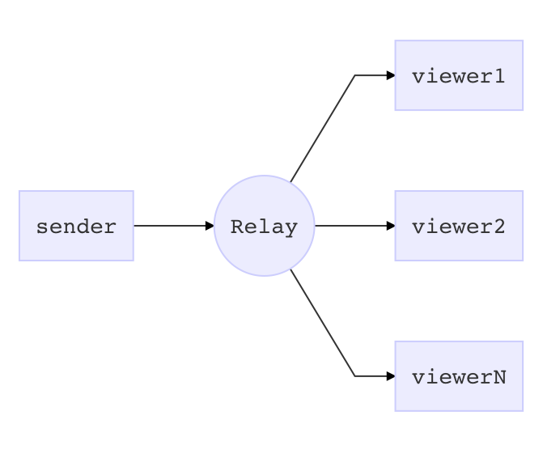

# CASTO SDK
The javascript implementation of the CASTO platform.

# Install
```
npm install --save @casto/sdk
```

# Tutorial and Examples
## Basic
### for sender
```javascript
const Casto = require('@casto/sdk')
streamer = new Casto({type: "sender"})
```
### for viewer
```javascript
const Casto = require('@casto/sdk')
viewer = new Casto({type: "viewer"})
viewer.onSendChannelsList = ({channels}) => {
  for (const channel in channels) {
    /* Do some stuff for channel list */
    button.addEventListener('click', ()=> {
      /* media should be a mediaElement for streaming */
      media.srcObject = await casto.getChannel(channel.peerId})
    })
  }
}
```

## For other web frameworks (TBD)
* react tutorial
* vue tutorial
* vanilla javascript tutorial

# Modules

## sender ( `{type: "sender"}` )
module that send stream to specific `serviceId`
## viewer ( `{type: "viewer"}` )
module that receive channel list of `serviceId` and choose stream from the list to view.
## relay
service that relays copies of the sender's stream to viewers.
* https://prisms.casto.tv/serviceId=<SERVICE_ID>
* default: https://prisms.casto.tv/serviceId=TESTO

# API
## Methods
### Create a Casto - new Casto(options)
> create an instance of the Casto
Require keys in the `options` object:
* `type`: type of casto instance. If you want to do a broadcast, set `sender` or set `viewer` if you want to watch a broadcast.
* `serviceId`: default is `TESTO`
### casto.start(): MediaStream<Promise>
> start a broadcast by the Casto.
Should return a `MediaStream`, which is an object for transfer to the remote.

### casto.getChannel(peerId): MediaStream<Promise>
> Should return a `MediaStream`, which is an object that received broadcasting from `peerId`

## Events
### Sender
#### casto.onNodeInitiated:
> Casto is initiated. Ready to connect to relay nodes. 

#### casto.onReadyToCast:
> Successfully connected to a relay node and is ready to start broadcasting.  

#### casto.onCompleted:
> webRTC peerConnection is 'completed'. currently sending stream to a relay.

#### casto.onClosed:
> webRTC peerConnection is 'closed'.

### Viewer
#### casto.onNodeInitiated: <function>
> Casto is initiated. Ready to connect to relay nodes. 

#### casto.onReadyToCast: <function>
> Successfully connected to a relay node and is ready to view streams.

#### casto.onClosed: <function>
> webRTC peerConnection is 'closed'.

#### casto.onSendChannelsList: <function>
> Retrieved available lists of channels from relay nodes.

#### casto.onSendChannelRemoved: <function>
> Channel is removed.

#### casto.onSendChannelAdded: <function>
> Channel is added.

#### casto.onWavesUpdated: <function>
> Received the updated channel information.

## License

[MIT](LICENSE) © Casto Network